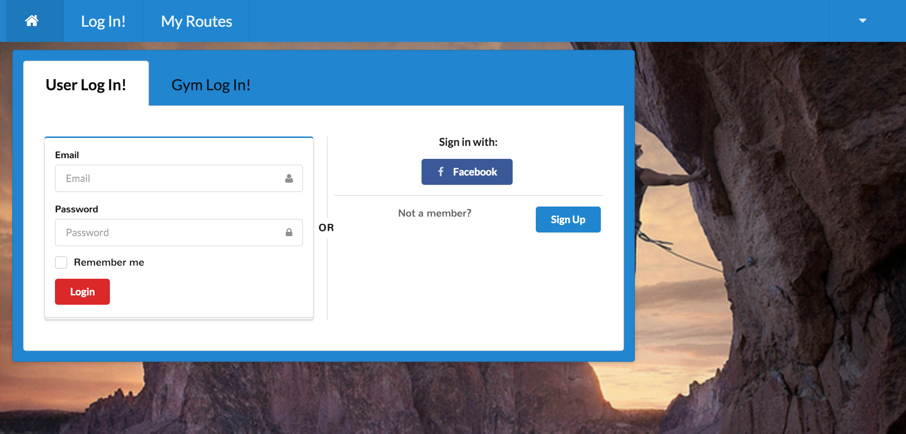

# topOut README(App currently in progress)

topOut is a MEAN stack web application built for climbers and the gyms they belong to.  The app allows the user to track their climb history, gain points for completing challenges and find other local climbers.

Heroku link: https://topout-app.herokuapp.com/#/

### Technologies Used:
* MongoDB
* Express
* Angular
* Node
* jQuery
* Mongoose

### Getting Started
The quickest way to get started using the app is to visit https://hidden-plains-1055.herokuapp.com/#/ and sign up.From there you can begin tracking your climbs. See the screen shots below for an idea of the site layout!

### Challenges
A main challenge of this project was overscoping.  With minimal experience building MEAN Stack Apps it was difficult to know where speedbumps would arise.  We had difficulty implementing authentication as well as seperating our concerns while coding.  Too much time was spent debugging minor issues causing us to have to drastically cut back the functionality we were hoping for.

### What's Next
* Build out the ability for a gym to sign in and log the routes that are currently set at their location
* Allow gyms to set challenges and award points for those challenges
* Build out the social aspect of the app, allowing users to follow eachother and set up climb sessions
* Build out functionality to graphically display a climber's progress
* Build out the app in Ionic to have a working mobile app for testing
